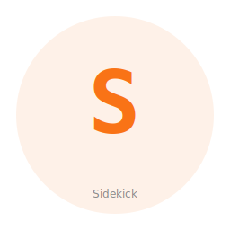

# Sidekick — Agent Utility Collection



**Sidekick collection** — Agent micro-utilities for Phenotype org. 5 members, 3 canonical.

A named Rust workspace consolidating core agent infrastructure utilities for the Phenotype ecosystem.

## Members

| Name | Repository | Status | FR Prefix | Purpose |
|------|-----------|--------|-----------|---------|
| **agent-imessage** | [agent-imessage](../agent-imessage) | CANONICAL | FR-MSG | iMessage/SMS messaging bridge (MCP server) |
| **agent-user-status** | [agent-user-status](../agent-user-status) | CANONICAL | FR-USR | User presence & status tracking (MCP server) |
| **cheap-llm-mcp** | [cheap-llm-mcp](../cheap-llm-mcp) | CANONICAL | FR-LLM | Budget LLM routing (FastMCP + Python) |
| **PhenoAgent** | [PhenoAgent](../PhenoAgent) | CANDIDATE | FR-AGN | Agent framework with skill system (W-67F) |
| **phenotype-skills** | [phenotype-skills](../phenotype-skills) | CANDIDATE | FR-SKL | Reusable skill library (W-67F) |

## Quick Start

```bash
cd /Users/kooshapari/CodeProjects/Phenotype/repos/Sidekick
cargo build --release
cargo test --workspace
```

## Integration Map

- **agent-imessage** — MCP tools: `tool_send_message`, `tool_get_recent_messages`, `tool_fuzzy_search_messages`
- **agent-user-status** — MCP tools: `user_status`, `record_presence_signal`, `set_user_status`
- **cheap-llm-mcp** — Skill routing for low-cost LLM completions (Minimax, Kimi, Fireworks)
- **PhenoAgent** — Foundational agent framework; integrates cheap-llm-mcp + agent-imessage + agent-user-status
- **phenotype-skills** — Shared skill definitions consumed by PhenoAgent and external agents

## Architecture

Sidekick is a polyglot workspace:
- **Rust crates** (`crates/sidekick-*`): Compiled binaries and libraries
- **Python sub-package** (`crates/sidekick-cheap-llm`): FastMCP wrapper, imported as Python module

Each sub-crate is independently versioned and consumable; consumers import only what they need.

## Release Registry

See `release-registry.toml` for version metadata, stability information, and sub-crate status. The master index of all Phenotype collections is at `../phenotype-collections.toml`.

Schema documentation: `docs/governance/release_registry_schema.md`

## Cross-Collection Integration

Sidekick is part of the **Phenotype named collections**:

- **Sidekick** (this) — Agent dispatch & presence
- **Eidolon** — Device automation (desktop, mobile, sandbox)
- **Observably** — Distributed tracing & observability
- **Stashly** — State, events, caching, migrations
- **Paginary** — Knowledge collection (specs, tutorials, handbooks)

### Event Bus

Sidekick uses **phenotype-bus** for cross-collection communication. Collections emit domain events that other collections consume without hardcoded dependencies:

```rust
use phenotype_bus::{Bus, Event};
use serde::Serialize;

#[derive(Clone, Serialize)]
pub struct DispatchStarted {
    pub provider: String,
}

impl Event for DispatchStarted {
    fn event_name(&self) -> &'static str { "DispatchStarted" }
}

// Emit event
let bus = Bus::new(100);
bus.publish(DispatchStarted { provider: "forge".into() }).await?;

// Subscribe in another collection (e.g., Eidolon)
let mut rx = bus.subscribe();
while let Ok(event) = rx.recv().await {
    println!("Got dispatch event: {}", event.event_name());
}
```

See `../../phenotype-bus/README.md` and `docs/org-audit-2026-04/collection_build_matrix.md` for integration details.

## Publishing

Crates published to crates.io under `sidekick-*` prefix.

## See Also

Explore Sidekick and other Phenotype collections at the [Collections Showcase](https://dev.phenotype.io/collections).

**Sibling Collections:**
- **[Eidolon](../Eidolon)** — Unified trait-based device automation (desktop, mobile, sandbox)
- **[Stashly](../Stashly)** — Storage & persistence (caching, event sourcing, state machines)
- **[Observably](../PhenoObservability)** — Observability & distributed tracing
- **[Paginary](../Paginary)** — Knowledge collection (specs, tutorials, handbooks)
- **[phenotype-shared](../phenoShared)** — Rust infrastructure toolkit (domain, application, ports)

## Development & Governance

**AgilePlus Tracking**: All work tracked in `/repos/AgilePlus`. Review `CLAUDE.md` for development contracts and policies.

**Quality Gates**:
```bash
cargo build --release --workspace      # Full release build
cargo test --workspace                 # Complete test suite
cargo clippy --workspace -- -D warnings # Zero warnings required
cargo fmt --check                      # Format validation
```

**Crate Publishing**: Each sub-crate published independently to crates.io with `sidekick-*` prefix. Version metadata in root `Cargo.toml`.

**Cross-Collection Integration**: Sidekick integrates with phenotype-bus for async event streaming. Other collections (Stashly, Observably, Eidolon) consume dispatch events for specialized handling.

## Related Phenotype Collections

- **[Eidolon](../Eidolon)** — Device automation & virtualization
- **[Observably](../Observably)** — Distributed tracing & observability
- **[Stashly](../Stashly)** — State, events, caching, persistence
- **[Paginary](../Paginary)** — Knowledge collection
- **[phenotype-shared](../phenotype-shared)** — Shared infrastructure

## License

Apache 2.0

**Status**: Active development (Phase 2 in progress)  
**Collections Showcase**: https://dev.phenotype.io/collections  
**Last Updated**: 2026-04-24
