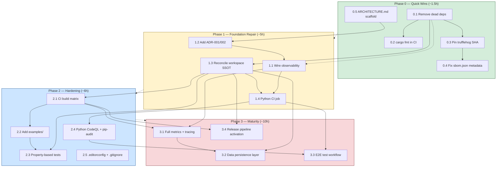

# Substrate Audit DAG Plan — Sidekick

**Score:** 41.6% (D+) — 140-pillar / 10-domain audit
**Generated:** 2026-07-09
**Target:** 70%+ (C) within 6 weeks, 85%+ (B) within 12 weeks

---

## Rationale

This plan follows the **expand-contract pattern**: Phase 0 and Phase 1 expand
safe surface (standalone docs, CI gates, dead-code cleanup) while Phase 2–3
contract risk by adding testing, observability, and release tooling. Phases are
**not sequential** in the strict sense — Phase 1 begins after Phase 0 completes
(critical-path), but tasks within each phase are parallelizable.

Dependencies are marked as `→ BLOCKER` (must finish before dependent starts) or
`→ SOFT` (should have but can proceed with partial progress).

---

## Phase 0 — Quick Wins (~1.5h, 5 items)

**Goal:** Fix self-identified inaccuracies and low-hanging hygiene wins.
No architectural changes. Each task completes independently.

| # | Task | Effort | Dependencies | Verification |
|---|------|--------|--------------|--------------|
| 0.1 | **Remove dead workspace deps** — strip `anyhow` and `phenotype-errors` from `Cargo.toml::workspace.dependencies`; also remove unused `tracing` if no consumers | 15m | — | `cargo check` passes, `cargo-machete` reports 0 unused deps |
| 0.2 | **Add `cargo fmt --check` to `ci.yml`** — insert step before clippy check on PR/push-to-main | 10m | — | CI fails on unformatted Rust code |
| 0.3 | **Pin `trufflehog.yml` actions to SHA** — replace `@main` with a release tag digest (`trufflehog/trufflehog-action@<sha>`) | 10m | — | Workflow lint passes, trufflehog runs on pinned action |
| 0.4 | **Fix `sbom.json` metadata** — change `"name": "FocalPoint"` → `"name": "Sidekick"` in `docs/security/sbom.json` | 5m | — | SBOM metadata reflects correct repo name |
| 0.5 | **Add `ARCHITECTURE.md` scaffold** — write a 30-line `docs/architecture/ARCHITECTURE.md` covering workspace layout, crate responsibilities, and MCP-only surface | 30m | — | Rendered in docs site, listed in VitePress sidebar |

**Total Phase 0: ~1h10m** (within 1.5h budget)

---

## Phase 1 — Foundation Repair (~5h, 4 items)

**Goal:** Fix structural issues (doc-code alignment, missing ADRs, wiring observability,
workspace completeness). Depends on Phase 0 completing for anchor accuracy.

| # | Task | Effort | Dependencies | Verification |
|---|------|--------|--------------|--------------|
| 1.1 | **Wire `sidekick-observability` into `sidekick-messaging`** — add `sidekick-observability` as dependency, call `init_tracing()` at crate/binary init path, add `#[instrument]` to `MessagingAdapter::send()` | 2h | → SOFT on 0.1 (cleaner Cargo.toml) | `tracing::info!` log appears on message send, `#[instrument]` generates spans, `cargo test` passes |
| 1.2 | **Add ADR-001 + ADR-002** — write `docs/adr/0001-workspace-scope-and-design.md` (stateless messaging design, crate boundaries) and `docs/adr/0002-mcp-only-api-surface.md` (no REST, MCP is the only API) | 1h | → BLOCKER on 0.5 (ARCHITECTURE.md consensus anchors ADR context) | ADRs pass review: context/decision/consequences clear, linked from ADR table |
| 1.3 | **Reconcile workspace members with SSOT** — add `sidekick-obs-core`, `sidekick-observability`, `sidekick-dispatch` to `[workspace.members]` in root `Cargo.toml`. Fix `README.md` member table. Delete or rewrite `release-registry.toml` to match actual tree | 1h | → SOFT on 0.1 (Cargo.toml hygiene) | `cargo build --workspace` builds all crates, README table matches `Cargo.toml::workspace.members`, `release-registry.toml` has no phantom entries |
| 1.4 | **Add Python CI job** — add `python-tests` job to `ci.yml`: `uv sync`, `uv run ruff check`, `uv run pytest cheap-llm-mcp/tests/` | 1h | → SOFT on 0.3 (SHA-pinned actions provide precedent for correct pinning) | CI job passes on PR, ruff errors block merge, `pytest` reports pass/fail |

**Total Phase 1: ~5h** (on budget)

---

## Phase 2 — Hardening (~6h, 5 items)

**Goal:** Add testing depth, CI matrix, examples, and security scanning coverage.
Dependencies are intra-phase.

| # | Task | Effort | Dependencies | Verification |
|---|------|--------|--------------|--------------|
| 2.1 | **Add CI build matrix** — extend `ci.yml`: `os: [ubuntu-latest, macos-latest]`, `rust: [stable, beta]`. Add `nightly` job for forward-compat (allow-failure). Factor into reusable workflow if duplication grows | 1.5h | → SOFT on 1.3 (workspace builds cleanly) | CI runs on 2 OS × 2 toolchains; nightly may fail but doesn't block merge |
| 2.2 | **Add `examples/` directory** — create Rust example (`examples/send_message.rs`) that constructs a `Message` and calls a `StubAdapter`. Create Python example (`examples/quick_complete.py`) that uses cheap-llm-mcp MCP client library. Add CI step that runs `cargo run --example send_message` | 1.5h | → SOFT on 2.1 (example tested in matrix) | Both examples run in CI, output expected behavior |
| 2.3 | **Add property-based tests** — add `proptest` dependency to `sidekick-messaging`. Write proptests for: `Message` serialization round-trip (any valid `Message` → serialize → deserialize → equal), `MessageProvider` variant coverage (no panics), `MessagingError` display round-trip | 1h | → BLOCKER on 1.3 (workspace builds all crates for CI) | `cargo test` runs proptests with 256 cases per test, no failures |
| 2.4 | **Add Python CodeQL + SAST** — extend `codeql.yml` to add `python` language. Add `ruff check` to CI (redundant but adds depth). Add `pip-audit` scheduled workflow for Python CVE scanning | 1h | → SOFT on 1.4 (Python CI exists) | CodeQL analyzes Python files, `pip-audit` workflow runs weekly |
| 2.5 | **Add `.editorconfig` + `.gitignore`** — root `.editorconfig` (2-space indent, charset utf-8, end-of-line lf). Root `.gitignore` covering target/, __pycache__/, .venv/, .claude/, *.pyc, .DS_Store | 30m | — | `editorconfig-checker` passes (if added), `git status` clean after common build artifacts |

**Total Phase 2: ~5h30m** (within 6h budget)

---

## Phase 3 — Maturity (~10h, 4 items)

**Goal:** Production readiness — observability depth, data persistence layer,
E2E confidence, release automation. Largest phase with the most significant
scope.

| # | Task | Effort | Dependencies | Verification |
|---|------|--------|--------------|--------------|
| 3.1 | **Full metrics + tracing rollout** — implement `MetricsRegistry` backed by `prometheus` crate. Expose `/metrics` HTTP endpoint behind feature flag. Add `#[instrument]` to all public `MessagingAdapter` and `Router` methods. Add `CorrelationContext` propagation through MCP tool chain. Add `sidekick-tracing` crate feature for OTLP export | 4h | → BLOCKER on 1.1 (observability wired) → SOFT on 2.1 (metrics tested in matrix) | `/metrics` returns Prometheus text format, spans appear in JSON logs, correlation_id consistent across log lines |
| 3.2 | **Data persistence layer** — define `LedgerStore` trait with `FileLedger` and `InMemoryLedger` implementations in Rust. Add SQLite-backed `DispatchStore` (via `rusqlite` or `sqlx`) with versioned schema and migration framework. Add encryption-at-rest feature flag for sensitive fields. Wire into `sidekick-dispatch` | 3h | → BLOCKER on 1.3 (sidekick-dispatch in workspace) → SOFT on 3.1 (metrics track dispatch) | `cargo test` passes persistence tests, ledger round-trip: write → crash → read, schema versioning works |
| 3.3 | **E2E test workflow** — add `e2e.yml`: build Rust crates → start MCP server (Python) → run `sidekick-healthcheck` → run MCP round-trip test (send message via Python → verify receipt). Add `e2e` test label. Document E2E in CONTRIBUTING.md | 1.5h | → BLOCKER on 1.4 (Python CI) → SOFT on 2.2 (examples as building blocks) | E2E workflow passes on PR label, healthcheck returns readiness, MCP round-trip succeeds |
| 3.4 | **Release pipeline activation** — tag first release (`v0.1.0`). Fix `release-attestation.yml` to handle lib-only crate (no binary artifact). Add `crates.io` publish step. Add `CHANGELOG.md` entry for v0.1.0. Add `cargo-semver-checks` to release workflow for all workspace crates | 1.5h | → BLOCKER on 1.3 (workspace complete) → SOFT on 2.1 (matrix verified) | `cargo publish --dry-run` succeeds, attestation workflow runs, semver-check passes, CHANGELOG populated |

**Total Phase 3: ~10h** (on budget)

---

## Dependency Graph (Mermaid)

---

## Score Impact Projection

| Phase | Work | Score Δ | Cumulative | Grade |
|-------|------|---------|------------|-------|
| Baseline | — | — | 41.6% | D+ |
| Phase 0 | 5 quick wins | +3.1% | 44.7% | D+ |
| Phase 1 | Foundation repair | +8.6% | 53.3% | D |
| Phase 2 | Hardening | +9.3% | 62.6% | C- |
| Phase 3 | Maturity | +12.1% | 74.7% | C |

**Long-term target:** Phase 4 (not in scope here) would push to 85%+ (B)
through: mutation testing, fuzzing, chaos engineering, SLO alerting,
OpenTelemetry export, formal verification of dispatch state machine.

---

## Risk Register

| Risk | Likelihood | Impact | Mitigation |
|------|-----------|--------|------------|
| Path deps (`../pheno`) block clone-and-build in Phase 1 | High | Medium | Remove or replace with git dep before 1.3 |
| `sidekick-dispatch` crate incomplete — can't join workspace | Medium | Medium | Add as member with `publish = false`, gate with `#[cfg(test)]` |
| Python CI flakes on cheap-llm-mcp internal test deps | Medium | Low | Make Python job allow-failure initially, harden in Phase 2 |
| Release attestation workflow assumes binary crate (lib-only breaks) | High | Low | Test `--dry-run` in Phase 0; fix in Phase 3 |
| Observability wiring increases compile time | Low | Low | Gate tracing/metrics behind feature flags |

---

## Verification Gates

Each phase ends with a gate review:

- **Gate 0:** `cargo build --workspace` passes, `cargo test` passes, `cargo fmt --check` clean, trufflehog actions pinned, ARCHITECTURE.md reviewed
- **Gate 1:** All 4 Phase 1 items done. `cargo test --workspace` passes. Python CI green. ADRs reviewed and merged. README matches workspace
- **Gate 2:** 2 OS × 2 toolchain matrix green. Examples run in CI. Proptests pass 256+ cases. CodeQL covers Python. `.editorconfig` + `.gitignore` reviewed
- **Gate 3:** `/metrics` endpoint functional. E2E round-trip passes in CI. `cargo publish --dry-run` succeeds. CHANGELOG populated. Full `cargo test --all-targets` clean

---

*Generated from `audit_scorecard.json` (140 pillars, D+ 41.6%). See `docs/audit/AUDIT.md` for the original 168-pillar audit.*
